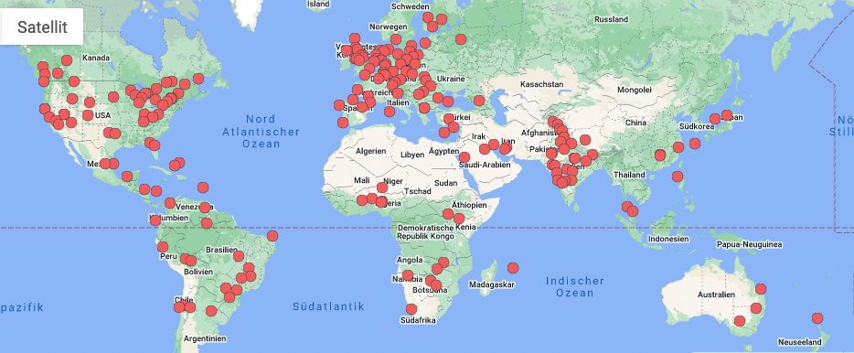

```{r setup, include=FALSE}
knitr::opts_chunk$set(echo = FALSE)
```

## Roadmap

* Communities of practice (CoPs): what are they?
\newline

* Why are CoPs important and how can they be sustained?
\newline

* Some CoPs in CompStat and Data Science
\newline

* Some guidelines in building inclusive communities and events


## What are communities of practice? (I)

*Communities of practice are **\textcolor[HTML]{d6d9d9}{groups of people}** who share a **\textcolor[HTML]{d4bdba}{concern}** or a **\textcolor[HTML]{d4bdba}{passion}** for something they **\textcolor[HTML]{edaa98}{do}** and learn how to **\textcolor[HTML]{edaa98}{do}** it better as they **\textcolor[HTML]{d6d9d9}{interact regularly}**.*
[(Wenger-Trayner)](https://wenger-trayner.com/introduction-to-communities-of-practice)


## What are communities of practice? (II)

CoPs are characterized by: being informal (typically), \pause 
voluntary membership, \pause
high degree of identification with the group. [@erik2005archetypes;@hoadley2012community]
\pause  

  * Examples: group of researchers working on a similar problem who meet on a regular basis, meetup groups etc.

## What are communities of practice? (III)

More formally: Concept from social or situated learning theory [@lave1991situated;@brown1991organizational;@orr1990sharing;@constant1987social]

  
  * CoPs are used to describe the process of learning and the spread of knowledge.
  
  * Situated view to learning: *learning is a relational property enacted by groups of people in context and in interaction with one another* [@lave1991situated]

  * CoPs are groups in which a constant process of legitimate **peripheral participation** takes place [@lave1991situated].


## Community composition: Foster inward mobility!


, @stevens2018building](figs/1.png){ width=100% }


## Goals of CoPs

[@wenger2000communities]

  * help to solve problems quickly \newline

  * develop professional skills \newline

  * set and transfer best practices

## Member benefits

[@wenger2000communities]

  * **short-term**: help with challenges, access to expertise, confidence, meaningful work, social aspects
  \newline
  
  * **long-term**: personal development, enhanced reputation, professional identity, networking


## Techniques to foster learning-oriented CoPs


1. improve **connectivity** -- linking people with others who have similar practices (social networking, directories or profiles)

2. access to **content** -- shared repository of information that is used by the community in its practices

3. supporting **conversation** -- providing tools for discussing with others in the community

4. providing information **context** -- providing awareness of the information context of various resources 

based on the C4P model in @kilner2004con4 and @hoadley2005using


## CoPs in CompStat and data science

{ width=100% }

<!-- * Skills: programming/software development, data analysis, math/stats/ML, knowledge of hardware, (technical) writing, creativity, communication, team work ... -->

<!-- * Good practices: sustainable software development, open, transparent, sound and impactful scientific results, promoting open science and reproducible and extensible research, data availability.  -->

<!-- * Interdisciplinary field -> a lot of potential for relevant CoPs -->

## Meetup groups

An accessible format for CoPs in CompStat and data science: **meetup groups**

  * [Meetup.com](https://meetup.com) is a platform for finding and building local communities

  * Regular events (online/in person) can be organized through the platform.

Tip: Many meetup groups organize joint events, so keep an eye for those to discover new communities.

## Some relevant meetup groups

* R User Local Groups (see also [R Consortium](https://www.r-consortium.org/all-projects/r-user-group-support-program))

* [R-Ladies](https://rladies.org/), a world-wide organization to promote gender diversity in the R community
    * offers an online directory of R-Ladies, 
    * global github repository
    * supports local chapters who organize events

* [Python User Groups](https://wiki.python.org/moin/LocalUserGroups)

* [PyLadies](https://pyladies.com/), a global group with the focus on getting more women involved in the Python open-source community

* [PyData Groups](https://www.meetup.com/de-DE/pro/pydata/)


* [Julia Users Groups](https://www.meetup.com/de-DE/topics/julia/all/?all=1)

* [Julia Gender Inclusive](https://discourse.julialang.org/t/announcing-julia-gender-inclusive/63702)


## 
\vspace{1em}
\begin{figure}
  \begin{columns}
    \begin{column}{.5\linewidth}
\includegraphics{figs/Rusergroups.png}
    \end{column}
    \begin{column}{.5\linewidth}
\includegraphics{figs/RLadiesgroups.png}
    \end{column}
      \end{columns}
    \caption{Active R User and R-Ladies Groups, \href{https://benubah.github.io/r-community-explorer/rugs.html}{Dashboard by Ben Ubah}}
    \end{figure}
\vspace{-3em}




## Building inclusive CoPs & events

 and Andy Burgin on [Medium](https://medium.com/@andyburgindevops/building-an-inclusive-and-diverse-tech-meetup-50efc5cf81e1)](figs/2.png){ width=100% }


## Thank you!


Laura Vana-Gür (TU Wien, R-Ladies Vienna Chapter)

Email: laura.vana.guer@tuwien.ac.at \newline
Github: https://github.com/lauravana \newline
Twitter: \@llauriciu, \@RLadiesVienna 

Slides are available at: https://github.com/lauravana/COMPSTAT2022

## References
